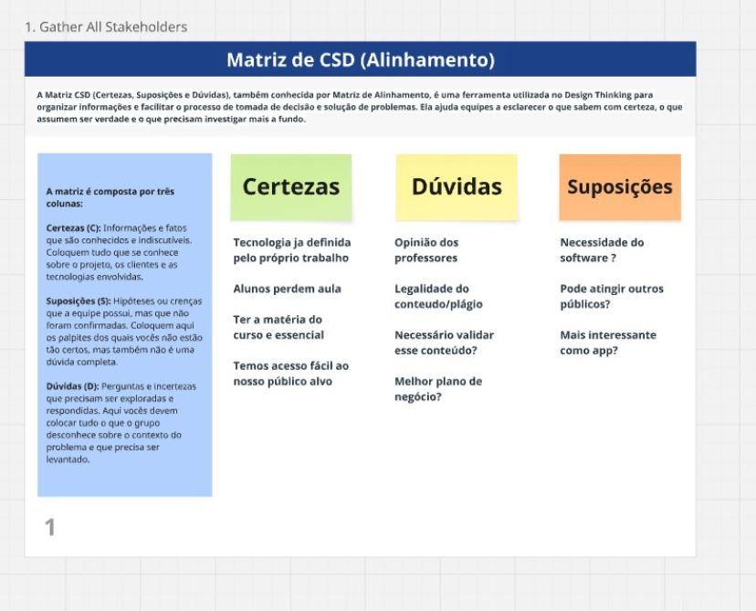
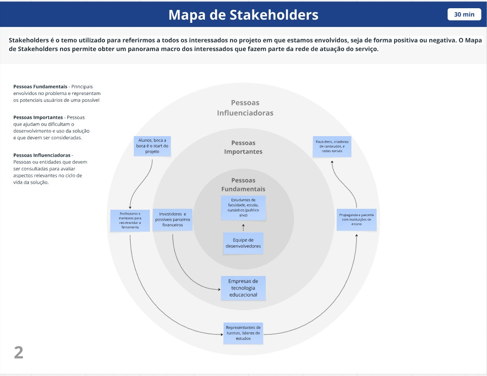

# Introdução
Tarefando

É uma plataforma digital voltada para universitários, que centraliza anotações,
provas antigas, atividades e dicas de professores em um só lugar. O aluno pode
compartilhar materiais, criar ou entrar em grupos de estudo e até buscar monitorias
com colegas. O objetivo é facilitar a organização acadêmica e garantir que ninguém
fique prejudicado quando perde uma aula, chega atrasado ou não consegue
acompanhar todo o conteúdo. Além disso, o sistema também prevê recursos de
avaliação de conteúdos, rankings de contribuição, criando um ambiente colaborativo
e motivador para alunos e professores.


* **Projeto:** [Tarefando]
* **Repositório GitHub:** [https://github.com/ICEI-PUC-Minas-PBR-SI/pbr-si-2025-2-p1-tiaw-t1-3013102-tarefando.git]
* **Membros da equipe:**

  * [Divan Antunes de Sene Junior](https://github.com/junior-j2)
  * [Maria Eduarda Vieira Orsi](https://github.com/dudaorsi)
  * [Isabelle Luísa Pereira da Silva](https://github.com/Isabelle1616-cod)
  * [Pedro Henrique de Freitas Gomes](https://github.com/Pedro271106)
  * [Wagner Dante Elohim Rodrigues](https://github.com/WaggsT)
  * [João Carlos do Nascimento](https://github.com/jotalps19)

A documentação do projeto é estruturada da seguinte forma:

1. Introdução
2. Contexto
3. Product Discovery
4. Product Design
5. Metodologia
6. Solução
7. Referências Bibliográficas

✅ [Documentação de Design Thinking (MIRO)](/docs/files/DOCUMENTAÇÃO%20DO%20PROJETO_%20TAREFANDO%20(1).pdf)

# Contexto

Na correria da vida universitária, muitos estudantes acabam se sentindo perdidos: perdem aulas, têm dificuldade para organizar os conteúdos e nem sempre conseguem acompanhar tudo o que é passado pelos professores. Às vezes, uma simples anotação perdida pode fazer muita falta.
O Tarefando nasceu justamente para ajudar nesses momentos. A ideia é criar um espaço colaborativo onde os alunos possam compartilhar anotações, provas antigas, atividades resolvidas, dicas e até formar grupos de estudo ou encontrar monitorias com colegas. Tudo em um só lugar.
Nosso objetivo é facilitar a rotina acadêmica, incentivar a troca entre os estudantes e garantir que ninguém fique para trás por causa de um imprevisto ou dificuldade. A proposta também inclui rankings de contribuição, avaliação de materiais e outras formas de engajar quem participa.
O público-alvo são estudantes de qualquer curso e idade, que buscam uma forma mais prática e solidária de estudar. O Tarefando quer transformar a forma como aprendemos: menos sozinho, mais junto.

## Problema

**✳️✳️✳️ COLOQUE AQUI O SEU TEXTO ✳️✳️✳️**

Muitos estudantes lutam para se manter organizados, perdem aulas importantes
ou não conseguem encontrar ajuda quando precisam. A falta de comunicação entre
colegas e professores e a dificuldade em gerenciar prazos e
materiais de estudo causam estresse e prejudicam o
desempenho acadêmico. Como resultado, muitos se sentem
sobrecarregados e sem controle sobre a própria jornada de
aprendizado.
 Para o estudante, conciliar a vida acadêmica e a pessoal é
um desafio constante. Muitos se sentem sobrecarregados pela
dificuldade de gerenciar as demandas de aulas, trabalhos e
provas, ao mesmo tempo em que tentam manter uma vida
social, cuidar da saúde e até mesmo trabalhar. 

## Objetivos

**✳️✳️✳️ COLOQUE AQUI O SEU TEXTO ✳️✳️✳️**
O Tarefando é um aplicativo criado para otimizar a vida
acadêmica do estudante, promovendo autocontrole e
organização.
Com ele, você pode:
● Recuperar anotações perdidas: Conecte-se com
colegas que estiveram presentes em aulas que você
faltou e tenha acesso às anotações.
● Aprimorar o aprendizado com grupos de estudo:
Participe de grupos de estudo específicos para cada
matéria, onde alunos e professores interagem e tiram
dúvidas, construindo uma comunidade de apoio mútuo.
● Gerenciar prazos: Use o calendário interativo
para acompanhar datas de entrega, provas e organizar
seu tempo de estudo, garantindo que você nunca perca
um prazo importante.
O Tarefando ajuda você a se manter no controle da sua jornada de aprendizado.

## Justificativa

**✳️✳️✳️ COLOQUE AQUI O SEU TEXTO ✳️✳️✳️**

> Por que o Tarefando é Importante?
A vida acadêmica e a pessoal são difíceis de conciliar. Muitos estudantes sentem-se
sobrecarregados, sem tempo para si, e lutam para se organizar.
Pesquisas mostram que 75% dos universitários relatam estresse frequente, e 60%
atribuem isso à falta de organização. Além disso, 85% dos estudantes já se
sentiram prejudicados por não terem acesso a anotações de aulas que perderam ou
por não terem orientação adequada.
O Tarefando surge como uma solução direta para esses problemas. Nossa
motivação é simples:
● Grupos de estudo por matéria: Conectamos alunos, superando a dificuldade
de formar grupos de estudo eficazes.
● Acesso a anotações: Criamos uma rede de apoio para que nenhum aluno seja
deixado para trás, garantindo que o material de estudo esteja sempre
disponível.
● Mentorias: Oferecemos a possibilidade de orientação de professores ou
alunos mais experientes, o que é crucial para aqueles que precisam de um
direcionamento mais pessoal.
● Calendário interativo: Centralizamos todos os prazos em um só lugar para
reduzir a ansiedade e a desorganização.

## Público-Alvo

**✳️✳️✳️ COLOQUE AQUI O SEU TEXTO ✳️✳️✳️**

Mercado e Público-Alvo do Tarefando
O mercado para o Tarefando é o vasto universo da educação superior, focado em
estudantes de graduação. Este segmento, em constante crescimento e cada vez
mais digitalizado, exige soluções que não apenas otimizem o estudo, mas que se
integrem fluidamente à rotina de um jovem adulto. O público principal do Tarefando
são estudantes de ensino superior.

# Product Discovery

## Etapa de Entendimento

**✳️✳️✳️ APRESENTE OS ARTEFATOS DA ETAPA  ✳️✳️✳️**
> * **Matriz CSD**

**Mapa de stakeholders**


**Entrevistas qualitativas**

● Ponto de Vista do Professor: Os professores percebem de perto a dificuldade
dos alunos em se organizar, notando que muitos perdem anotações e
atividades. Eles também enfrentam uma sobrecarga de trabalho digital, já que precisam retomar o conteúdo
individualmente ou em pequenos grupos. Um professor relatou ter tido que
lidar com pais pedindo material para filhos que perderam a aula. Para eles,
uma ferramenta ideal seria colaborativa e não lhes daria a responsabilidade
de inserir todo o material.

● A Dificuldade dos Alunos: A principal dor dos alunos é a desorientação e a
sobrecarga de informações, não apenas a falta de material. Eles se perdem
com a quantidade de matérias e prazos, e a falta de uma rotina estruturada
os leva a depender de estratégias manuais, como pedir ajuda a colegas ou
pesquisar na internet. A busca por conteúdo na internet gera insegurança,
pois nem sempre o material é confiável.

● O Problema da Socialização: Outra dificuldade é a dependência de grupos de
amigos para obter materiais. Isso se torna um problema para aqueles que
não socializaram, deixando-os desamparados quando perdem uma aula. A
solução atual de pedir anotações a colegas é ineficaz e não confiável.

● As Ferramentas Atuais são Insuficientes: Os entrevistados mencionaram o
uso de ferramentas como o Google Classroom e Trello, mas as consideram
insuficientes. Essas ferramentas podem ficar "bagunçadas" sem a disciplina
do usuário, e a comunicação manual entre professores e alunos não é eficaz.

**Highlights de pesquisa**

A pesquisa e as entrevistas com estudantes e professores revelaram que a falta de
organização e o estresse acadêmico são os principais problemas que o aplicativo
Tarefando busca solucionar.

● Problemas dos Alunos: A maior dificuldade
é a desorientação e a sobrecarga de
informações, que os leva a depender de
métodos ineficazes, como pedir anotações
a colegas ou pesquisar na internet. Além
disso, a dependência de grupos de amigos
se torna um problema para aqueles que
não socializaram. Eles também percebem
que as ferramentas digitais que já utilizam
não são suficientes para centralizar tudo.

● Visão do Professor: O professor também
enfrenta uma sobrecarga de trabalho, pois
muitas vezes precisa retomar o conteúdo com
alunos individualmente. Para ele, a ferramenta
ideal seria colaborativa e daria mais autonomia
aos alunos.

● Funcionalidades Essenciais: Os entrevistados pediram as seguintes
funcionalidades:
  ○ Centralização: Um local único para materiais, tarefas e prazos.
  ○ Colaboração: Ferramentas para grupos de estudo, fóruns de dúvidas e
 compartilhamento de anotações.
  ○ Organização: Calendário e lembretes para gerenciar prazos.
  ○ Recuperação de Conteúdo: Um recurso para acessar facilmente o que
  foi perdido em aulas.

Em resumo, o Tarefando se propõe a ser uma plataforma de apoio que promove a
autonomia, reduz o estresse e constrói uma comunidade de aprendizado, indo além
de um simples repositório.

## Etapa de Definição

### Personas

**✳️✳️✳️ APRESENTE OS DIAGRAMAS DE PERSONAS ✳️✳️✳️**


[Personas](files/Personas.pdf)


# Product Design

Nesse momento, vamos transformar os insights e validações obtidos em soluções tangíveis e utilizáveis. Essa fase envolve a definição de uma proposta de valor, detalhando a prioridade de cada ideia e a consequente criação de wireframes, mockups e protótipos de alta fidelidade, que detalham a interface e a experiência do usuário.

## Histórias de Usuários

Com base na análise das personas foram identificadas as seguintes histórias de usuários:

| EU COMO...`PERSONA` | QUERO/PRECISO ...`FUNCIONALIDADE`    | PARA ...`MOTIVO/VALOR`                 |
| ------------------- | ------------------------------------ | -------------------------------------- |
| Aluno               |acessar resumos e anotações de colegas|recuperar o conteúdo que perdi.         |
| Aluno               | baixar provas e exercícios antigos   | me preparar melhor para avaliações.    |
| Aluno               |postar minhas anotações e materiais   |ajudar colegas que também perderam a aula|
| Professsor  |visualizar as dúvidas mais frequentes dos alunos|adaptar minhas aulas e reforçar os pontos mais críticos.|
| Professor           |o acompanhar o material compartilhado  | para garantir a qualidade do conteúdo. |
| Coordenador |relatórios de engajamento dos alunos no aplicativo|monitorar a efetividade da ferramenta no aprendizado.|

## Proposta de Valor

**✳️✳️✳️ APRESENTE O DIAGRAMA DA PROPOSTA DE VALOR PARA CADA PERSONA ✳️✳️✳️**

##### Proposta de valor para Persona


## Requisitos

As tabelas que se seguem apresentam os requisitos funcionais e não funcionais que detalham o escopo do projeto.

### Requisitos Funcionais

| ID     | Descrição do Requisito                              | Prioridade |
| ------ | --------------------------------------------------- | ---------- |
| RF-001 | Permitir acesso a materiais                         | ALTA       |
| RF-002 | Marcar aulas com monitores                          | MÉDIA      |
| RF-003 | Quadro de horários e calendário                     | ALTA      |
| RF-004 | opção de cancelamento de monitorias                 | MÉDIA      |
| RF-005 | Cadastro de novos alunos                            | ALTA      |
| RF-006 | Armazenar os materiais adicionados                  | ALTA      |
| RF-007 | Excluir e editar dados já adicionados               | ALTA      |
| RF-008 | Compra e avaliação de materiais                     | BAIXA      |
| RF-009 | cadastro de usuários /login                         | ALTA      |
| RF-010 | Menu de suporte para dúvidas                        | MÉDIA      |
### Requisitos não Funcionais

| ID      | Descrição do Requisito                                                        | Prioridade |
| ------- | ----------------------------------------------------------------------------- | ---------- |
| RNF-001 | Manter os dados dos usuários seguros                                          | ALTA       |
| RNF-002 | Aplicação resonsiva                                                           | MÉDIA      |
| RNF-003 | Envio de confirmação                                                          | MÉDIA      |

## Projeto de Interface

Artefatos relacionados com a interface e a interacão do usuário na proposta de solução.

### Wireframes

Estes são os protótipos de telas do sistema.

**✳️✳️✳️ COLOQUE AQUI OS PROTÓTIPOS DE TELAS COM TÍTULO E DESCRIÇÃO ✳️✳️✳️**

Descrição para a tela XPTO


### User Flow

**✳️✳️✳️ COLOQUE AQUI O DIAGRAMA DE FLUXO DE TELAS ✳️✳️✳️**


### Protótipo Interativo

**✳️✳️✳️ COLOQUE AQUI UM IFRAME COM SEU PROTÓTIPO INTERATIVO ✳️✳️✳️**

✅ [Protótipo Interativo (figma)](https://www.figma.com/site/KOR7IZ0Vtx04IeLB7X6TZ7/Sem-t%C3%ADtulo?node-id=0-1&t=TScJah0BPWHIhlt6-1)


# Metodologia

Detalhes sobre a organização do grupo e o ferramental empregado.

## Ferramentas

Relação de ferramentas empregadas pelo grupo durante o projeto.

| Ambiente                    | Plataforma | Link de acesso                              |
| --------------------------- | ---------- | ------------------------------------------- |
| Processo de Design Thinking | Miro       | https://miro.com/XXXXXXX         |
| Repositório de código       | GitHub     |   https://github.com/ICEI-PUC-Minas-PBR-SI/pbr-si-2025-2-p1-tiaw-t1-3013102-tarefando.git         |
| Hospedagem do site          | Render     | https://site.render.com/XXXXXXX|
| Protótipo Interativo        | figma      | https://www.figma.com/site/KOR7IZ0Vtx04IeLB7X6TZ7/Sem-t%C3%ADtulo?node-id=0-1&t=TScJah0BPWHIhlt6-1 |
|                             |            |                                             |

## Gerenciamento do Projeto

A organização de tarefas, foi baseada nas postagens no canvas, de acordo com a
demanda e datas de entrega, os membros do grupo dividiram entre si o'que cada um
deve fazer, além disso, também vale ressaltar:
-
Alinhamento das tarefas, tomadas de decisões e dúvidas sempre sendo
compartilhada em nosso grupo de mensagens.
-
A cada parte finalizada, é enviada no grupo para visualização e que todos
possam das opiniões e críticas construtivas para que chegue na melhor
versão possível para o usuário

# Solução Implementada

Esta seção apresenta todos os detalhes da solução criada no projeto.

## Vídeo do Projeto

O vídeo a seguir traz uma apresentação do problema que a equipe está tratando e a proposta de solução. ⚠️ EXEMPLO ⚠️

[](https://www.youtube.com/embed/70gGoFyGeqQ)

> ⚠️ **APAGUE ESSA PARTE ANTES DE ENTREGAR SEU TRABALHO**
>
> O video de apresentação é voltado para que o público externo possa conhecer a solução. O formato é livre, sendo importante que seja apresentado o problema e a solução numa linguagem descomplicada e direta.
>
> Inclua um link para o vídeo do projeto.

## Funcionalidades

Esta seção apresenta as funcionalidades da solução.Info

##### Funcionalidade 1 - Cadastro de Contatos ⚠️ EXEMPLO ⚠️

Permite a inclusão, leitura, alteração e exclusão de contatos para o sistema

* **Estrutura de dados:** [Contatos](#ti_ed_contatos)
* **Instruções de acesso:**
  * Abra o site e efetue o login
  * Acesse o menu principal e escolha a opção Cadastros
  * Em seguida, escolha a opção Contatos
* **Tela da funcionalidade**:


> ⚠️ **APAGUE ESSA PARTE ANTES DE ENTREGAR SEU TRABALHO**
>
> Apresente cada uma das funcionalidades que a aplicação fornece tanto para os usuários quanto aos administradores da solução.
>
> Inclua, para cada funcionalidade, itens como: (1) titulos e descrição da funcionalidade; (2) Estrutura de dados associada; (3) o detalhe sobre as instruções de acesso e uso.

## Estruturas de Dados

Descrição das estruturas de dados utilizadas na solução com exemplos no formato JSON.Info

##### Estrutura de Dados - Contatos   ⚠️ EXEMPLO ⚠️

Contatos da aplicação

```json
  {
    "id": 1,
    "nome": "Leanne Graham",
    "cidade": "Belo Horizonte",
    "categoria": "amigos",
    "email": "Sincere@april.biz",
    "telefone": "1-770-736-8031",
    "website": "hildegard.org"
  }
  
```

##### Estrutura de Dados - Usuários  ⚠️ EXEMPLO ⚠️

Registro dos usuários do sistema utilizados para login e para o perfil do sistema

```json
  {
    id: "eed55b91-45be-4f2c-81bc-7686135503f9",
    email: "admin@abc.com",
    id: "eed55b91-45be-4f2c-81bc-7686135503f9",
    login: "admin",
    nome: "Administrador do Sistema",
    senha: "123"
  }
```

> ⚠️ **APAGUE ESSA PARTE ANTES DE ENTREGAR SEU TRABALHO**
>
> Apresente as estruturas de dados utilizadas na solução tanto para dados utilizados na essência da aplicação quanto outras estruturas que foram criadas para algum tipo de configuração
>
> Nomeie a estrutura, coloque uma descrição sucinta e apresente um exemplo em formato JSON.
>
> **Orientações:**
>
> * [JSON Introduction](https://www.w3schools.com/js/js_json_intro.asp)
> * [Trabalhando com JSON - Aprendendo desenvolvimento web | MDN](https://developer.mozilla.org/pt-BR/docs/Learn/JavaScript/Objects/JSON)

## Módulos e APIs

Esta seção apresenta os módulos e APIs utilizados na solução

**Images**:

* Unsplash - [https://unsplash.com/](https://unsplash.com/) ⚠️ EXEMPLO ⚠️

**Fonts:**

* Icons Font Face - [https://fontawesome.com/](https://fontawesome.com/) ⚠️ EXEMPLO ⚠️

**Scripts:**

* jQuery - [http://www.jquery.com/](http://www.jquery.com/) ⚠️ EXEMPLO ⚠️
* Bootstrap 4 - [http://getbootstrap.com/](http://getbootstrap.com/) ⚠️ EXEMPLO ⚠️

> ⚠️ **APAGUE ESSA PARTE ANTES DE ENTREGAR SEU TRABALHO**
>
> Apresente os módulos e APIs utilizados no desenvolvimento da solução. Inclua itens como: (1) Frameworks, bibliotecas, módulos, etc. utilizados no desenvolvimento da solução; (2) APIs utilizadas para acesso a dados, serviços, etc.

# Referências

As referências utilizadas no trabalho foram:

* SOBRENOME, Nome do autor. Título da obra. 8. ed. Cidade: Editora, 2000. 287 p ⚠️ EXEMPLO ⚠️

> ⚠️ **APAGUE ESSA PARTE ANTES DE ENTREGAR SEU TRABALHO**
>
> Inclua todas as referências (livros, artigos, sites, etc) utilizados no desenvolvimento do trabalho.
>
> **Orientações**:
>
> - [Formato ABNT](https://www.normastecnicas.com/abnt/trabalhos-academicos/referencias/)
> - [Referências Bibliográficas da ABNT](https://comunidade.rockcontent.com/referencia-bibliografica-abnt/)
